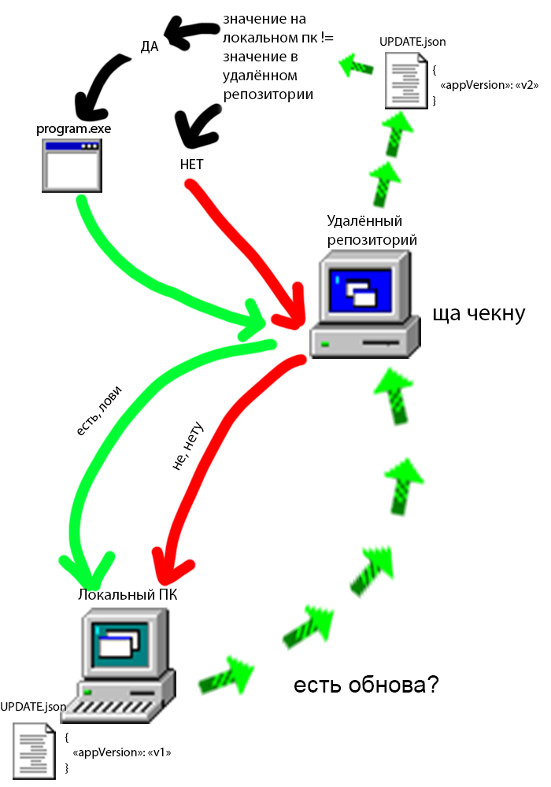

***

**CheckiAutoUpdater (CAU)** - простенькая программа, которая обновляет какой либо файл с удалённого репозитория.

**Примечание:** вместе с прогой дожен быть файл конфигурации: `CAUconfig.json`.

***



***

**Пример использования:**

- Есть прога `program.exe`. Все обновления приходят в github: `https://github.com/user/program_repo`. Мы хотим сделать так чтобы пользователь не заходил в гитхаб и скачивал прогу оттуда, а чтобы прога обновилась по двойному щелчку мыши и нажатия одной клавиши.
- В репозитории добавляем `.json` файл, за которым будет следить прога, например `UPDATE.json`, в нём добавляем содержимое:
```
{
    "appVersion": "v1.0"
}
```
- И в `CAUconfig.json` добавляем:
```
{
    "urlCheck": "https://github.com/user/program_repo/blob/master/UPDATE.json?raw=true",
    "appVersion": "v1.0",
    "urlDownload": "https://github.com/user/program_repo/blob/master/program.exe?raw=true",
    "downloadPath": "program.exe"
}
```
***
- `urlCheck`: следить за изменениями в файле `UPDATE.json` в удалённом репозитории.
- `appVersion`: текущая версия файла в локальном компьютере.
- `urlDownload`: ссылка на скачивание обновлённого файла в репозитории.
- `downloadPath`: по какому пути загрузить обновлённый файл.
***

- Обновили мы `program.exe` до версии `v2.0`, теперь надо изменить соддержимое `UPDATE.json`:
```
{
    "appVersion": "v2.0"
}
```
- Пушим в гитхаб. Теперь в локальном компьютере `CheckiAutoUpdater` после запуска увидит, что в файле `UPDATE.json` появились изменения, а именно значение в `appVersion` изменилось с `v1.0` на `v2.0`, и он предложит загрузить обновлённый `program.exe` с удалённого репозитория. 
***
### Все вопросы задавайте [сюда](https://github.com/ivnktrv/CheckiAutoUpdater/issues)

***
### Хотите внести свой вклад в проект? - читайте [здесь](CONTRIBUTING.md)
***
